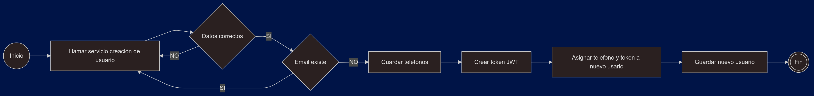

# Ejercicio Java Spring Boot para la empresa Nisum

### Building and running the application

#### Using Docker Compose

When you're ready, start the application by running:
`docker compose up --build`.

#### Using Command Line

To build the Docker image, run:
`docker build -t myapp .`.

Then, start your application with the following command:
`docker run -p 8080:8080 myapp`.

### Using Maven

You can also use Maven to package the application. Run the following command:
`mvn clean package`.
This will generate a JAR file in the `target` directory. You can then run the application with:
`java -jar target/<name-of-your-jar>.jar`.
Replace `<name-of-your-jar>` with `users-0.0.1-SNAPSHOT.jar`.

The application will be available at http://localhost:8080.

### Testing your Application

#### API Endpoints Overview

To test the application's API, you can use tools like **Postman**, **cURL**, or the Swagger UI available at:  
[http://localhost:8080/swagger-ui/index.html](http://localhost:8080/swagger-ui/index.html).

Here is a step-by-step guide for testing the main endpoints:

#### 1. **User Creation Endpoint**

- **Endpoint:** `POST /api/v1/user`
- **Purpose:** To create a new user in the system.
- **Example Request Body (JSON):**
  ```json
  {
    "name": "string",
    "email": "string",
    "password": "string",
    "phones": [
      {
      "number": "string",
      "citycode": "string",
      "countrycode": "string"
      }
    ]
  }
  ```
- **Expected Response:**
  ```json
  {
  "id": "3fa85f64-5717-4562-b3fc-2c963f66afa6",
  "createdAt": "2024-12-10T15:52:19.436Z",
  "updatedAt": "2024-12-10T15:52:19.436Z",
  "lastLogin": "2024-12-10T15:52:19.436Z",
  "token": "string",
  "active": true
  }
  ```

#### 2. **Login Endpoint**

- **Endpoint:** `POST /api/v1/users/login`
- **Purpose:** To authenticate a user and retrieve a Bearer token.
- **Example Request Body (JSON):**
  ```json
  {
    "email": "string",
    "password": "string"
  }
  ```
- **Expected Response:** Upon successful login, the server will return a JWT token:
  ```json
  { 
  "id": "3fa85f64-5717-4562-b3fc-2c963f66afa6",
  "name": "string",
  "email": "string",
  "password": "string",
  "phones": [
    {
      "id": "3fa85f64-5717-4562-b3fc-2c963f66afa6",
      "number": "string",
      "cityCode": "string",
      "countryCode": "string"
    }
  ],
  "lastLogin": "2024-12-10T15:54:59.448Z",
  "token": "string",
  "createdAt": "2024-12-10T15:54:59.448Z",
  "updatedAt": "2024-12-10T15:54:59.448Z",
  "active": true
  }
  ```

#### 3. **Get All Users Endpoint**

- **Endpoint:** `GET /api/v1/users`
- **Purpose:** To fetch all registered users.
- **Authentication:** This endpoint requires a Bearer token for access.
    - Add the token in the request header as follows:
      ```
      Authorization: Bearer your-jwt-token-here
      ```
- **Expected Response:**
  ```json
  [
    {
    "id": "3fa85f64-5717-4562-b3fc-2c963f66afa6",
    "name": "string",
    "email": "string",
    "password": "string",
    "phones": [
      {
        "id": "3fa85f64-5717-4562-b3fc-2c963f66afa6",
        "number": "string",
        "cityCode": "string",
        "countryCode": "string"
      }
    ],
    "lastLogin": "2024-12-10T15:56:12.659Z",
    "token": "string",
    "createdAt": "2024-12-10T15:56:12.659Z",
    "updatedAt": "2024-12-10T15:56:12.659Z",
    "active": true
  }
  ]
  ```

---

You can use the provided Swagger UI URL to explore these endpoints and see additional details about the required data,
headers, and request/response formats.  
URL: [http://localhost:8080/swagger-ui/index.html](http://localhost:8080/swagger-ui/index.html)
---
### Construyendo y ejecutando la aplicación

#### Usando Docker Compose

Cuando estés listo, inicia la aplicación ejecutando:  
`docker compose up --build`.

#### Usando la línea de comandos

Para construir la imagen de Docker, ejecuta:  
`docker build -t myapp .`.

Luego, inicia la aplicación con el siguiente comando:  
`docker run -p 8080:8080 myapp`.

### Usando Maven

También puedes usar Maven para empaquetar la aplicación. Ejecuta el siguiente comando:  
`mvn clean package`.  
Esto generará un archivo JAR en el directorio `target`. Luego, puedes ejecutar la aplicación con:  
`java -jar target/<nombre-del-jar>.jar`.  
Reemplaza `<nombre-del-jar>` con `users-0.0.1-SNAPSHOT.jar`.

La aplicación estará disponible en http://localhost:8080.

### Probando la aplicación

#### Descripción general de los endpoints de la API

Para probar la API de tu aplicación, puedes usar herramientas como **Postman**, **cURL** o la interfaz Swagger UI
disponible en:  
[http://localhost:8080/swagger-ui/index.html](http://localhost:8080/swagger-ui/index.html).

Aquí tienes una guía paso a paso para probar los endpoints principales:

#### 1. **Endpoint para crear usuario**

- **Endpoint:** `POST /api/v1/user`
- **Propósito:** Crear un nuevo usuario en el sistema.
- **Ejemplo del cuerpo de la solicitud (JSON):**
  ```json
  {
    "name": "string",
    "email": "string",
    "password": "string",
    "phones": [
      {
        "number": "string",
        "citycode": "string",
        "countrycode": "string"
      }
    ]
  }
  ```
- **Respuesta esperada:**
  ```json
  {
    "id": "3fa85f64-5717-4562-b3fc-2c963f66afa6",
    "createdAt": "2024-12-10T15:52:19.436Z",
    "updatedAt": "2024-12-10T15:52:19.436Z",
    "lastLogin": "2024-12-10T15:52:19.436Z",
    "token": "string",
    "active": true
  }
  ```

#### 2. **Endpoint de inicio de sesión**

- **Endpoint:** `POST /api/v1/users/login`
- **Propósito:** Autenticar un usuario y recuperar un token Bearer.
- **Ejemplo del cuerpo de la solicitud (JSON):**
  ```json
  {
    "email": "string",
    "password": "string"
  }
  ```
- **Respuesta esperada:** Después de un inicio de sesión exitoso, el servidor devolverá un token JWT:
  ```json
  { 
    "id": "3fa85f64-5717-4562-b3fc-2c963f66afa6",
    "name": "string",
    "email": "string",
    "password": "string",
    "phones": [
      {
        "id": "3fa85f64-5717-4562-b3fc-2c963f66afa6",
        "number": "string",
        "cityCode": "string",
        "countryCode": "string"
      }
    ],
    "lastLogin": "2024-12-10T15:54:59.448Z",
    "token": "string",
    "createdAt": "2024-12-10T15:54:59.448Z",
    "updatedAt": "2024-12-10T15:54:59.448Z",
    "active": true
  }
  ```

#### 3. **Endpoint para obtener todos los usuarios**

- **Endpoint:** `GET /api/v1/users`
- **Propósito:** Recuperar todos los usuarios registrados.
- **Autenticación:** Este endpoint requiere un token Bearer para el acceso.
  - Agrega el token al encabezado de la solicitud de la siguiente manera:
    ```
    Authorization: Bearer tu-token-jwt-aquí
    ```
- **Respuesta esperada:**
  ```json
  [
    {
      "id": "3fa85f64-5717-4562-b3fc-2c963f66afa6",
      "name": "string",
      "email": "string",
      "password": "string",
      "phones": [
        {
          "id": "3fa85f64-5717-4562-b3fc-2c963f66afa6",
          "number": "string",
          "cityCode": "string",
          "countryCode": "string"
        }
      ],
      "lastLogin": "2024-12-10T15:56:12.659Z",
      "token": "string",
      "createdAt": "2024-12-10T15:56:12.659Z",
      "updatedAt": "2024-12-10T15:56:12.659Z",
      "active": true
    }
  ]
  ```

---

Puedes usar la URL de Swagger UI proporcionada para explorar estos endpoints y ver detalles adicionales sobre los datos
requeridos, encabezados y formatos de solicitud/respuesta.  
URL: [http://localhost:8080/swagger-ui/index.html](http://localhost:8080/swagger-ui/index.html)

### Diagrama de flujo creación de usuario


